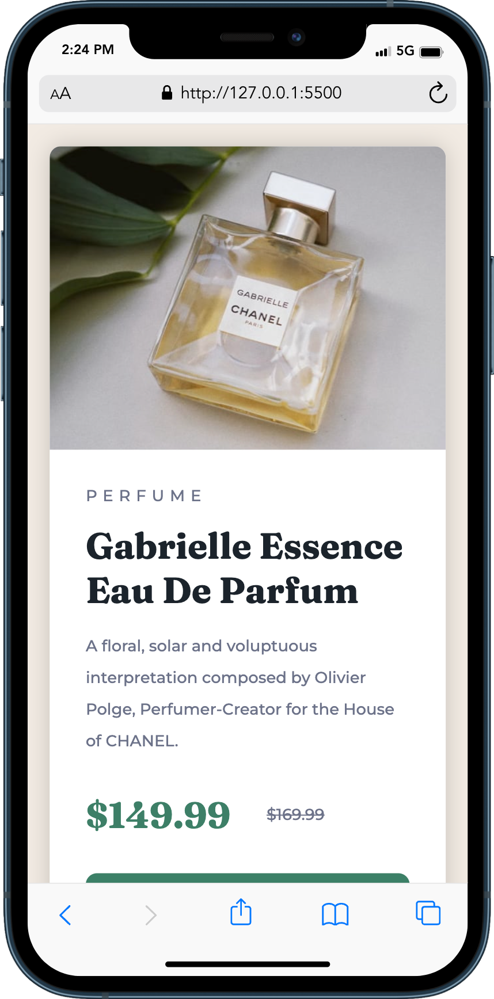

# Frontend Mentor - Product preview card component solution

This is a solution to the [Product preview card component challenge on Frontend Mentor](https://www.frontendmentor.io/challenges/product-preview-card-component-GO7UmttRfa). Frontend Mentor challenges help you improve your coding skills by building realistic projects.

## Table of contents

- [Overview](#overview)
  - [The challenge](#the-challenge)
  - [Screenshot](#screenshot)
  - [Links](#links)
- [My process](#my-process)
  - [Built with](#built-with)
  - [What I learned](#what-i-learned)
- [Author](#author)

## Overview

### The challenge

Users should be able to:

- View the optimal layout depending on their device's screen size
- See hover and focus states for interactive elements

### Screenshot

### Links

- Solution URL: [Add solution URL here](https://your-solution-url.com)
- Live Site URL: [Add live site URL here](https://your-live-site-url.com)

## My process

I started by separating the content into containers and adding classes to each piece of content. Then I went through and setup the layout using flexbox. I initially tried inserting the image as an img element in the html, but was having difficulty getting it to fill the entire box (it seemed there was always a little extra space at the bottom). Finally I decided to place it as a background img in the css which seemed to work well, particularly as a responsive element. I placed the character "&nbsp;" in the empty img div so that I could add some demention to it.

### Built with

- HTML5
- CSS
- Flexbox

### What I learned

I learned that even when I think something is going to be straight forward, I still inevitably get stuck on something that makes it take much longer than anticipated. I imagine that gets better with experience.

## Author

- Website - [Christopher Specht](https://github.com/ctspecht12)
- Frontend Mentor - [@ctspecht12](https://www.frontendmentor.io/profile/ctspecht12)
